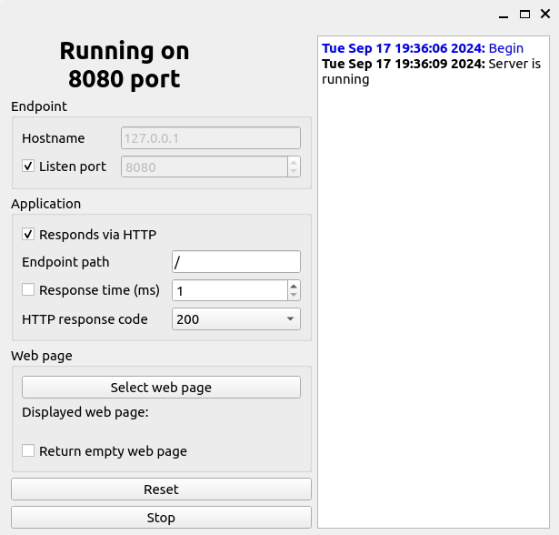

# WebMonDiag

Tool for simulating web application operation and errors, including API (only GET menthod supported).
Can be useful for setting up and testing monitoring systems, as well as for mocking up a simple API. 
Tested for Linux and Windows.

Capability to control:
 * Listening to ports
 * HTTP responses
 * HTTP response delay
 * Endpoint path
 * HTTP status code return
 * Returned data (for example, a web page, JSON or XML)


 
## Implementation details

The application logic is implemented in the `wmdcore` module. The `wmdgui` and `wmdcli` modules implement a graphical and command interface.

## Dependencies

 * Qt 6.4 or later
 * CMake 3.16 or later

## Build

In root folder with CMakeLists.txt run:

```shell
cmake [-DCMAKE_PREFIX_PATH=/path/to/qt] [-DCMAKE_BUILD_TYPE=Release] -B build
cd build
```

### Linux

run `make`

### Windows 

- Visual Studio:

```shell
msbuild webmondiag.sln
```
	
- MinGW:	
```shell
mingw32-make
```

## Usage examples

### Command Line

 - Listen for HTTP requests on port 8080 at 127.0.0.1:
 
```shell
./wemondi_cli -n 127.0.0.1 -p 8080
```

### GUI

```shell
./wemondi_gui
```
